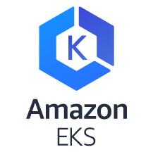
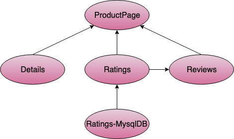

# eks-kubernetes-network-policies
> Amazon EKS supports native VPC networking via the Amazon VPC CNI plugin for Kubernetes. Using this CNI plugin allows Kubernetes pods to have the same IP address inside the pod as they do on the VPC network.  In order to implement network policies in your cluster, you must use a compatible container network plugin and Calico is one of the compatible technology. 

### Install Calico on your Amazon EKS cluster
```
kubectl apply -f https://raw.githubusercontent.com/aws/amazon-vpc-cni-k8s/master/config/v1.3/calico.yaml
```
A network policy is a specification of how groups of pods are allowed to communicate with each other and other network endpoints. By default, the pods communication is open within themselves and other endpoints. In a production level cluster, it is not secure to have open pod to pod communication. Execute the below command to restrict the access between pods and other network endpoints.
```
kubectl apply -f network-policy.yaml
```

